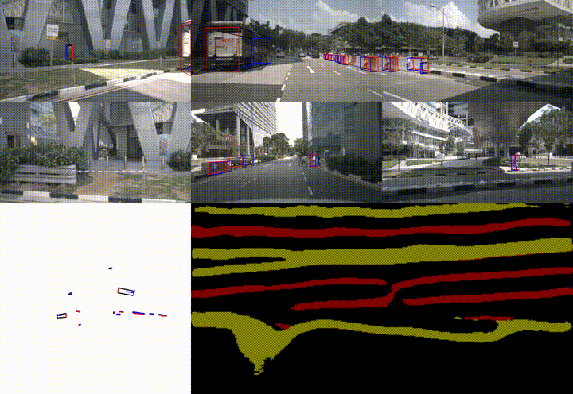

[English](./README.md) | 简体中文

# 功能介绍

BEV感知算法是使用OpenExplorer在[nuscenes](https://www.nuscenes.org/nuscenes)数据集上训练出来的`BEV`多任务模型。

算法输入为6组图像数据，分别是前视，左前，右前，后视，左后，右后图。模型输出为10个类别的目标以及对应的3D检测框，包括障碍物、多种类型车辆、交通标志等，以及车道线、人行道、马路边缘的语义分割。

此示例使用本地图像数据作为输入，利用BPU进行算法推理，发布算法感知结果渲染的图片消息，在PC端浏览器上渲染显示算法结果。

# 支持平台

| 平台                         | 系统                               |
| ---------------------------- | --------------------------------------------- |
| RDK Ultra               | Ubuntu 20.04 (Foxy) |
| RDK S100               | Ubuntu 22.04 (Humble) |

# 物料清单


# 使用方法

## 功能安装

在RDK系统的终端中运行如下指令，即可快速安装：

```bash
sudo apt update
sudo apt install -y tros-humble-hobot-bev
sudo apt install -y tros-humble-websocket
```

## 准备回灌数据集

在RDK系统的终端中运行如下指令，下载并解压数据集：

```shell
# 板端下载数据集
cd ~
wget http://archive.d-robotics.cc/TogetheROS/data/nuscenes_bev_val/nuscenes_bev_val.tar.gz

# 解压缩
mkdir -p ~/hobot_bev_data
tar -zxvf ~/nuscenes_bev_val.tar.gz -C ~/hobot_bev_data
```

## 启动算法和图像可视化

在RDK系统的终端中运行如下指令，启动算法和可视化：

```shell
# 配置tros.b humble环境
source /opt/tros/humble/setup.bash

# 启动运行脚本
# 如果存在qat软链接，先删除
if [ -L qat ]; then rm qat; fi
ln -s `ros2 pkg prefix hobot_bev`/lib/qat/ qat
ln -s ~/hobot_bev_data/nuscenes_bev_val nuscenes_bev_val

ros2 launch hobot_bev hobot_bev.launch.py
```

启动成功后，打开同一网络电脑的浏览器，访问RDK的IP地址`http://IP:8000`（IP为RDK的IP地址），即可看到算法可视化的实时效果：




# 接口说明

## 话题

| 名称         | 消息类型                             | 说明                                     |
| ------------ | ------------------------------------ | ---------------------------------------- |
| /image_jpeg  | sensor_msgs/msg/Image                | 周期发布的图像话题，jpeg格式             |

## 参数

| 名称                         | 参数值                               | 说明                                 |
| ---------------------------- | --------------------------------------------- | ------------------------------------------- |
| save_image               | "True"/"False", 默认为"False" | 将渲染后的图像保存到"./render"路径                    |


# 常见问题

通过设置运行时配置文件中的参数，用户可以修改回灌流程和感知结果的输出。

1. 获取运行时配置文件路径。

  在RDK上，使用如下命令查询运行时配置文件路径为：

  ```shell
    source /opt/tros/humble/setup.bash
    ls `ros2 pkg prefix hobot_bev`/lib/hobot_bev/config/bev_gkt_mixvargenet_multitask_nuscenes/workflow_latency.json
  ```

2. 控制回灌速度。

  `time_diff_ms表示每次回灌的间隔时间，单位为毫秒。默认为200毫秒，即每200毫秒回灌一次数据。

  ```json
    "time_diff_ms": 200
  ```

3. 保存算法输出和图片的渲染结果。

  `enable_save_output`为保存结果开关，默认不保存。`view_output_dir`表示保存结果的路径，默认为"./output_dir"。

  ```json
    "enable_save_output": false,
    "view_output_dir": "./output_dir",
  ```

4. 设置感知算法的后处理阈值？

  ```json
    "score_threshold": 0.5,
  ```

